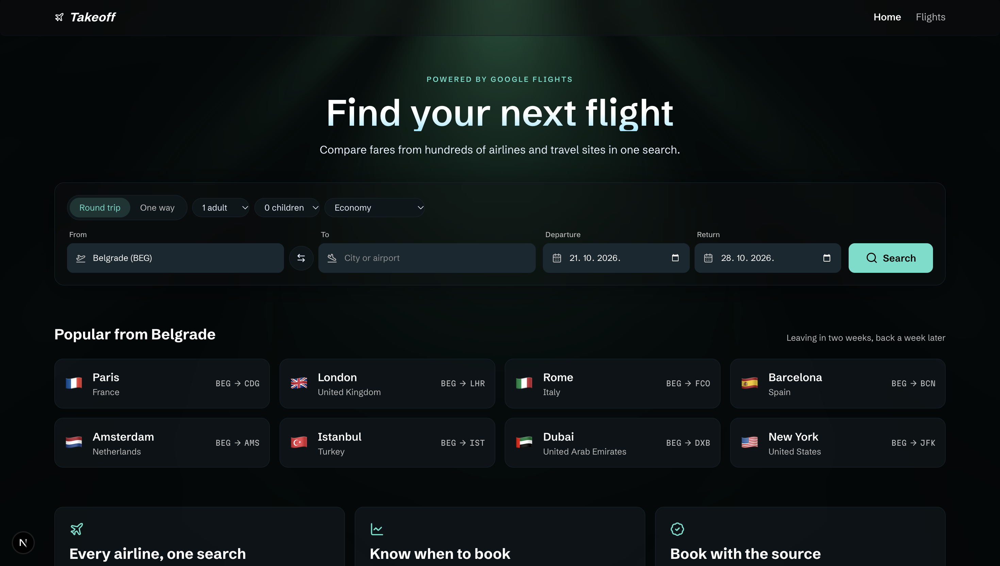
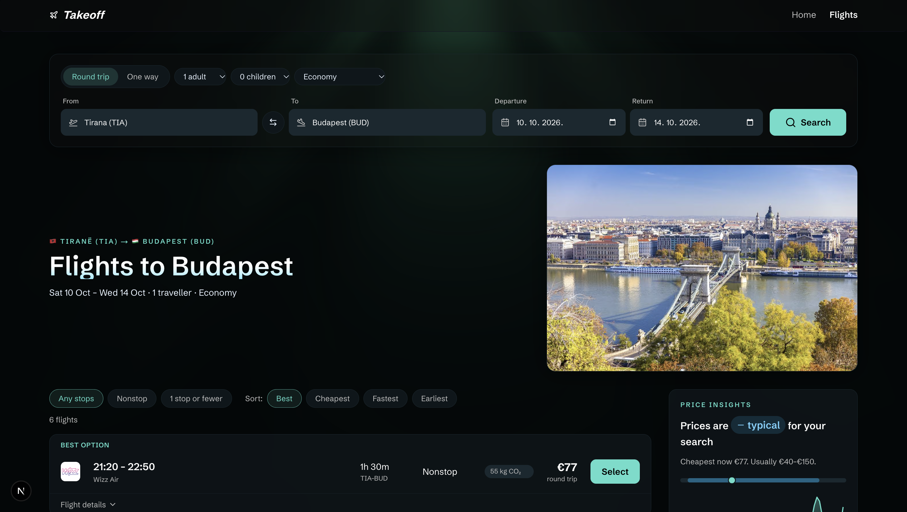
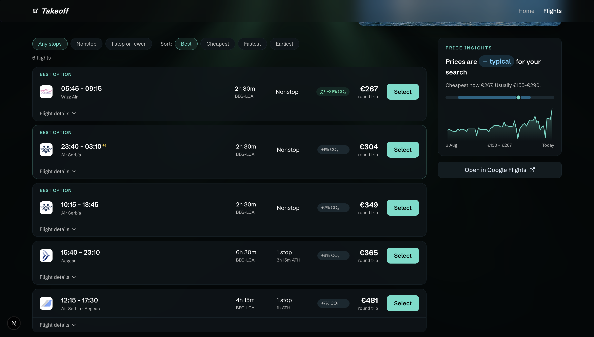
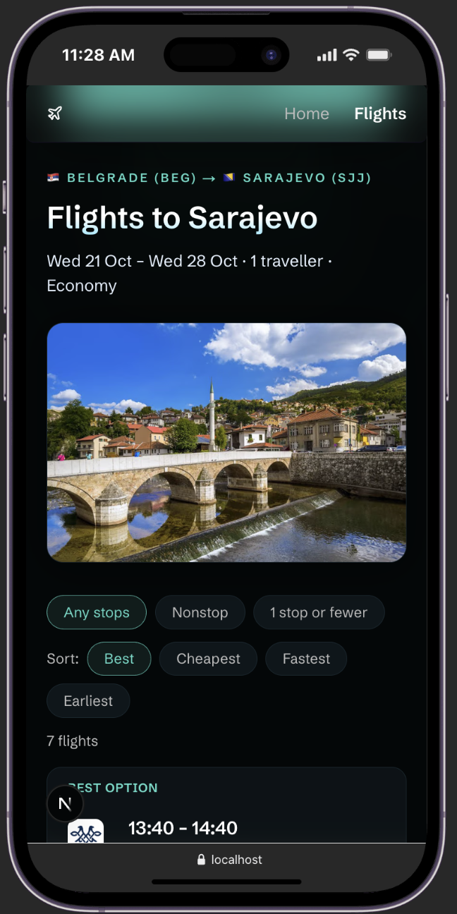
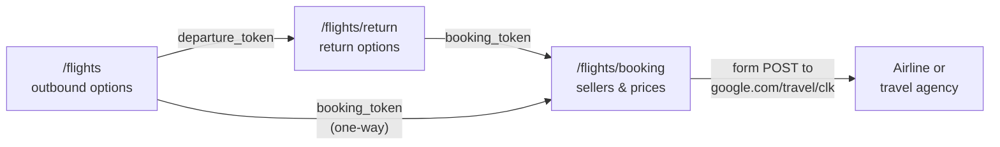

<div align="center">

# ✈️ Takeoff

**Flight search powered by Google Flights.**
Compare fares from hundreds of airlines and travel sites, see whether prices are low or high, and book directly with the seller.




</div>

---

## Contents

- [Features](#features)
- [Screenshots](#screenshots)
- [Tech stack](#tech-stack)
- [Getting started](#getting-started)
- [Environment variables](#environment-variables)
- [How it works](#how-it-works)
- [Project structure](#project-structure)
- [Configuration](#configuration)
- [Analytics](#analytics)
- [Scripts](#scripts)
- [Deployment](#deployment)
- [Troubleshooting](#troubleshooting)
- [Limitations](#limitations)

## Features

- **Full booking flow.** Search → pick the departing flight → pick the return flight → choose a seller. One-way trips skip the return step.
- **Airport autocomplete.** A keyboard-accessible combobox over 134 bundled airports, searchable by city, airport name, country or IATA code. Any other valid IATA code can be typed directly. Typing never calls the API.
- **Rich flight cards.** Departure and arrival times (with `+1` for next-day arrivals), duration, stops, layovers, CO₂ compared with the typical flight on the route, and an expandable itinerary with aircraft, flight numbers, legroom, overnight layovers and fare conditions.
- **Price insights.** Shows whether today's fares are *low*, *typical* or *high*, where the cheapest fare sits within the usual range, and a sparkline of the price history.
- **Instant filters and sorting.** Filter by number of stops and sort by best, cheapest, fastest or earliest. These run on the results already fetched, so they're instant and cost no API quota.
- **Booking options.** Compares airlines and travel agencies side by side, including fares sold as two separate tickets. Each option opens the seller through Google's booking redirect.
- **Sharp images.** Destination photos come from Google at about 1080 × 720 and are served through `next/image` as AVIF/WebP at quality 90. Their frame is at most 560 px wide, so they stay crisp on 2× screens. Airline logos are shown at half their 70 px source size and are never re-encoded.
- **Shareable URLs.** Every search, filter and step lives in the URL, so results can be bookmarked, shared, and navigated with the back button.
- **Resilient by design.** Loading skeletons and empty states. Clear messages for a missing API key, an exhausted quota or an invalid search. A custom 404 and an error boundary with retry.
- **Demo mode.** Without an API key the app runs on bundled real responses, so you can develop offline.

## Screenshots

<p align="center">
  
  <br />
  <em>Search results with destination photo, filters and price insights</em>
</p>

<table>
  <tr>
    <td width="68%" valign="top">
      
      <p align="center"><em>Flight list, CO₂ comparison and price history</em></p>
    </td>
    <td width="32%" valign="top">
      
      <p align="center"><em>Fully responsive on mobile</em></p>
    </td>
  </tr>
</table>

## Tech stack

| Area | Technology |
| --- | --- |
| Framework | [Next.js 16](https://nextjs.org) (App Router, Server Components, Turbopack) |
| UI | React 19, TypeScript 5, Tailwind CSS 4, [Lucide](https://lucide.dev) icons |
| Data | [SerpApi Google Flights API](https://serpapi.com/google-flights-api) |
| Caching | Next.js data cache (`fetch` with `revalidate`) |
| Analytics | [PostHog](https://posthog.com) (proxied through `/ingest`) |
| Visual effects | [OGL](https://github.com/oframe/ogl) WebGL light rays background |

## Getting started

### Prerequisites

- **Node.js 20.9 or newer**, which Next.js 16 requires
- A free **[SerpApi](https://serpapi.com/users/sign_up) account** (the free plan includes 250 searches a month)

### Installation

```bash
git clone <repository-url>
cd my-app
npm install
cp .env.example .env.local
```

Add your SerpApi key from [serpapi.com/manage-api-key](https://serpapi.com/manage-api-key) to `.env.local`, then start the dev server:

```bash
npm run dev
```

Open [http://localhost:3000](http://localhost:3000).

> **No key yet?** Leave `SERPAPI_API_KEY` empty. In development the app falls back to demo data (a real Belgrade → Paris search) and shows a banner saying so.

## Environment variables

| Variable | Required | Description |
| --- | --- | --- |
| `SERPAPI_API_KEY` | Yes, in production | SerpApi private key. It's only read on the server and never reaches the browser. |
| `SERPAPI_USE_FIXTURES` | No | `true` serves bundled demo responses in development, even when a key is set. Useful offline and to save quota. Ignored in production. |
| `NEXT_PUBLIC_BASE_URL` | Yes | Public URL of the app, used for absolute and Open Graph URLs, e.g. `https://takeoff.example.com`. |
| `NEXT_PUBLIC_POSTHOG_PROJECT_TOKEN` | No | PostHog project token. Leave it empty to disable analytics. |

## How it works

### Search flow

Google Flights builds an itinerary step by step. Each step returns a token for the next one:



| Route | Purpose | SerpApi request |
| --- | --- | --- |
| `/` | Hero search form and popular routes | none |
| `/flights` | Outbound options (round trip) or full itineraries (one way), price insights | `engine=google_flights` |
| `/flights/return` | Return options for the selected outbound flight | `+ departure_token` |
| `/flights/booking` | Booking options from airlines and agencies | `+ booking_token` |

The return page shows the selected outbound flight by looking it up in the cached outbound search, so that costs no extra request.

### Saving API quota

The SerpApi free plan has 250 searches a month, and **searches that find nothing count too**. The app keeps usage low:

1. **One request per step.** Successful responses are cached by Next.js for one hour, so repeat searches, refreshes and the back button are free. Only HTTP 200 responses are cached, so a failed request never gets stuck.
2. **Local filtering and sorting.** Stops and sort order are applied to results already fetched, so they never trigger a new request.
3. **Local airport autocomplete.** Suggestions come from a bundled list instead of SerpApi's autocomplete API.
4. **Demo mode.** Use `SERPAPI_USE_FIXTURES=true` while working on the UI.

### Security

- `lib/serpapi/client.ts` and `lib/flights/queries.ts` import `server-only`, so the API key can't end up in a client bundle.
- Every URL taken from API data is validated. Only `https:` links and images are rendered, which blocks `javascript:` injection.
- Booking redirects are only sent to `google.com`. Any other target is dropped.
- Query parameters are parsed defensively: unknown values fall back to defaults, and dates, passenger counts and airport codes are validated before any request is made.

### Accessibility

- The airport picker follows the [WAI-ARIA combobox pattern](https://www.w3.org/WAI/ARIA/apg/patterns/combobox/): arrow keys, Enter and Escape work, and the active option is announced.
- The app has a skip-to-content link and visible focus rings, and smooth scrolling respects `prefers-reduced-motion`.
- The price history chart has a text alternative that summarises it, and result counts are announced through `aria-live`.
- Filters, sorting, flight selection and booking are plain links and forms, so they work before JavaScript loads.

## Project structure

```text
my-app/
├── app/
│   ├── page.tsx                  # Home: search form, popular routes, features
│   ├── flights/
│   │   ├── page.tsx              # Results: destination hero, filters, flight list, price insights
│   │   ├── return/page.tsx       # Step 2: return flights for the chosen outbound flight
│   │   └── booking/page.tsx      # Step 3: booking options
│   ├── layout.tsx                # Fonts, metadata, navbar, background, footer
│   ├── not-found.tsx             # Custom 404
│   ├── error.tsx                 # Error boundary with retry
│   └── icon.svg                  # Favicon
├── components/
│   ├── FlightSearchForm.tsx      # Trip type, passengers, cabin, airports, dates (client)
│   ├── AirportCombobox.tsx       # Accessible airport autocomplete (client)
│   ├── FlightCard.tsx            # Flight summary with expandable itinerary
│   ├── PriceInsights.tsx         # Price level, typical range and history sparkline
│   ├── DestinationHero.tsx       # Route heading with destination photo
│   ├── BookingOptions.tsx        # Seller list and booking redirect forms (client)
│   └── …                         # Filters, steps, notices, images, navigation
├── lib/
│   ├── config.ts                 # Site and flight search settings
│   ├── serpapi/
│   │   ├── client.ts             # Generic SerpApi client: caching and error mapping
│   │   └── fixtures/             # Real SerpApi responses used in demo mode
│   └── flights/
│       ├── queries.ts            # searchFlights, searchReturnFlights, getBookingOptions
│       ├── mappers.ts            # Raw API data → typed, sanitised UI models
│       ├── search-params.ts      # URL ⇄ search state, validation, link builders
│       ├── filters.ts            # Local stop filter and sorting
│       ├── airports.ts           # Bundled airport list, search and flag emoji
│       ├── format.ts             # Prices, durations, dates and times
│       └── types.ts              # Raw SerpApi and normalised types
└── public/images/                # Placeholder and README screenshots
```

## Configuration

App-wide settings live in [`lib/config.ts`](lib/config.ts):

| Setting | Default | Description |
| --- | --- | --- |
| `siteConfig.name` | `Takeoff` | Brand name used in the navbar, titles and footer |
| `flightsConfig.currency` | `EUR` | Currency prices are requested and shown in |
| `flightsConfig.defaultOrigin` | `BEG` | Origin pre-filled on the home page |
| `flightsConfig.popularDestinations` | `CDG, LHR, FCO, …` | IATA codes shown as popular routes |

To add more airports to the autocomplete, extend the list in [`lib/flights/airports.ts`](lib/flights/airports.ts).

## Analytics

PostHog requests go through `/ingest` (see [`next.config.ts`](next.config.ts)) so ad blockers don't drop them. No personal data is sent.

| Event | Triggered when | Properties |
| --- | --- | --- |
| `flight_search_submitted` | A search is submitted | `from`, `to`, `trip`, `cabin`, `passengers` |
| `outbound_flight_selected` | A departing flight is chosen (round trip) | `airline`, `price`, `stops` |
| `return_flight_selected` | A return flight is chosen | `airline`, `price`, `stops` |
| `flight_selected` | A one-way flight is chosen | `airline`, `price`, `stops` |
| `booking_option_clicked` | A seller's booking button is clicked | `provider`, `airline`, `price` |

Page views and unhandled exceptions are captured automatically.

## Scripts

| Command | Description |
| --- | --- |
| `npm run dev` | Start the development server with Turbopack |
| `npm run build` | Create a production build |
| `npm run start` | Serve the production build |
| `npm run lint` | Run ESLint |
| `npm run typecheck` | Type-check the project with TypeScript |

## Deployment

The app deploys to [Vercel](https://vercel.com/new) or any platform that runs Next.js:

1. Import the repository.
2. Set `SERPAPI_API_KEY`, `NEXT_PUBLIC_BASE_URL` and, optionally, `NEXT_PUBLIC_POSTHOG_PROJECT_TOKEN`.
3. Deploy. Demo mode is always off in production, so a missing key shows a clear "not configured" message instead of fake data.

## Troubleshooting

| Symptom | Fix |
| --- | --- |
| `npm run dev` prints `> next dev` and then hangs | The project is probably inside an iCloud-synced folder such as Desktop, and iCloud has offloaded files from `node_modules`. Run `rm -rf node_modules .next && npm ci`, and preferably move the project out of iCloud. |
| `Could not read package.json` | Run the commands from the `my-app` folder, not from its parent. |
| "Too many searches" | The monthly SerpApi quota is used up. Cached searches keep working; switch on demo mode or wait for the monthly reset. |
| "Google Flights couldn't run this search" | Google rejected the search, for example because the date is in the past or the airport code is unknown. The message explains why. |
| Style changes don't show up | Restart the dev server. |

## Limitations

- Prices and availability come from Google Flights and are confirmed by the seller at checkout. They can change between search and booking.
- Prices are totals for all travellers in the configured currency. Times are local to each airport.
- Multi-city itineraries aren't supported yet.

---

<div align="center">
<sub>Flight data from Google Flights via <a href="https://serpapi.com/google-flights-api">SerpApi</a>. Takeoff is not affiliated with Google.</sub>
</div>
